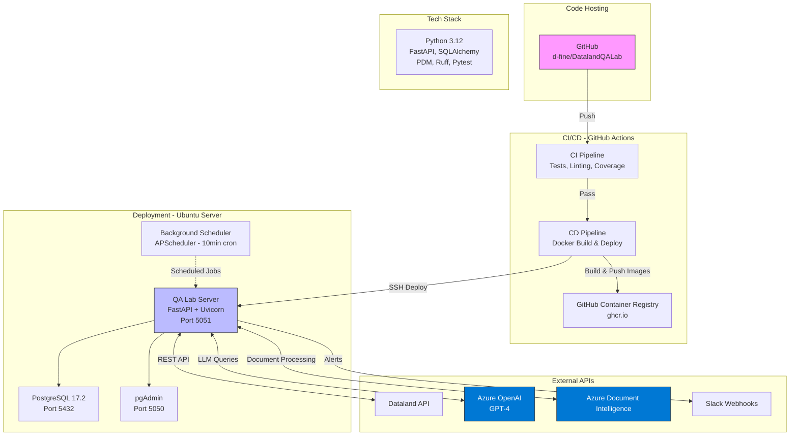
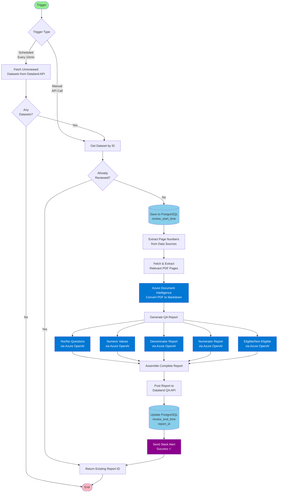

# Architecture Diagram

## Key Architecture Components

### Code Hosting
- **GitHub Repository**: d-fine/DatalandQALab

### Deployment
- **Platform**: Ubuntu server
- **Deployment Method**: SSH-based deployment via GitHub Actions
- **Container Orchestration**: Docker Compose
- **Container Registry**: GitHub Container Registry (ghcr.io)

### Application Stack
- **Framework**: FastAPI with Uvicorn (Python 3.12)
- **Database**: PostgreSQL 17.2
- **Database Management**: pgAdmin
- **Package Manager**: PDM
- **Linting/Formatting**: Ruff
- **Testing**: Pytest with coverage
- **Scheduler**: APScheduler (runs every 10 minutes)

### External APIs
- **Dataland API**: Primary data source for quality assurance
- **Azure OpenAI**: GPT-4 for automated review generation
- **Azure Document Intelligence**: Document processing and analysis
- **Slack**: Alerting and notifications

### CI/CD Pipeline
- **CI**: Automated testing, linting, formatting checks, and SonarCloud analysis
- **CD**: Docker image build and push to GHCR, followed by SSH deployment to production server

### Ports
- **5051**: QA Lab Server API
- **5432**: PostgreSQL Database
- **5050**: pgAdmin Web Interface

---

## Dataset Review Flow

### Review Process Steps

1. **Trigger**: Either scheduled (every 10 minutes) or manual API call to `/review/{data_id}`
2. **Fetch Dataset**: Retrieve unreviewed datasets or specific dataset by ID from Dataland API
3. **Check Database**: Verify if dataset already has a review to avoid duplicate processing
4. **Extract Pages**: Identify relevant pages from data source references
5. **Process Document**: Convert PDF pages to markdown using Azure Document Intelligence
6. **Generate Reports**: Use Azure OpenAI (GPT-4) to generate QA reports for:
   - Yes/No questions
   - Numeric values
   - Taxonomy-aligned denominator
   - Taxonomy-aligned numerator
   - Eligible/Non-eligible classifications
7. **Post Report**: Submit complete QA report back to Dataland API
8. **Update & Notify**: Update database and send Slack notification
